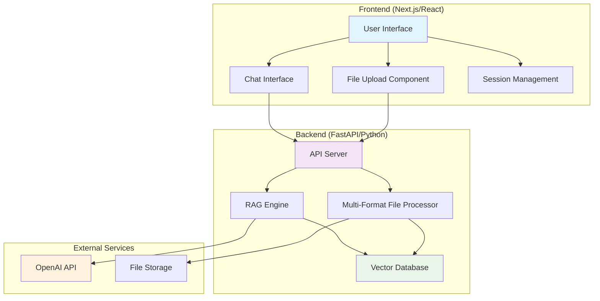
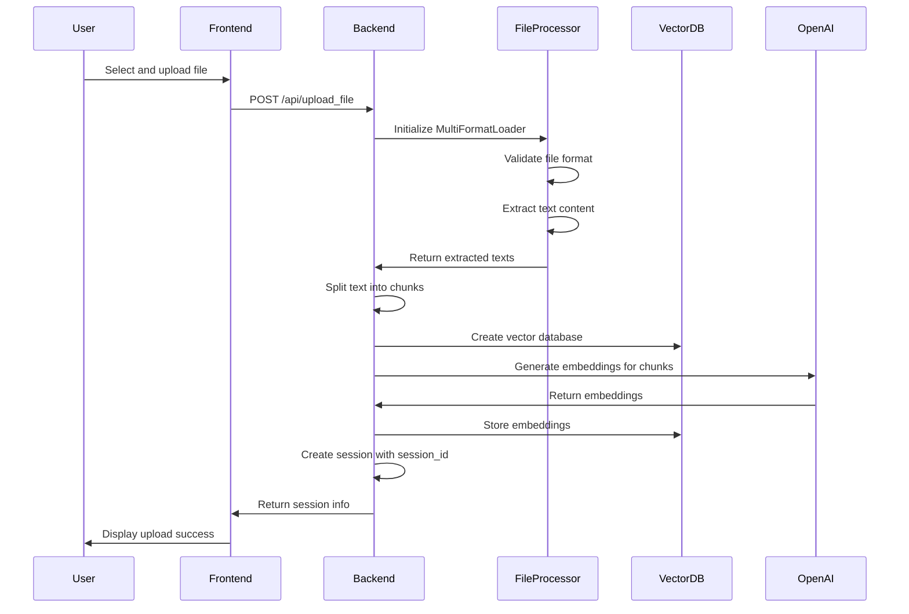
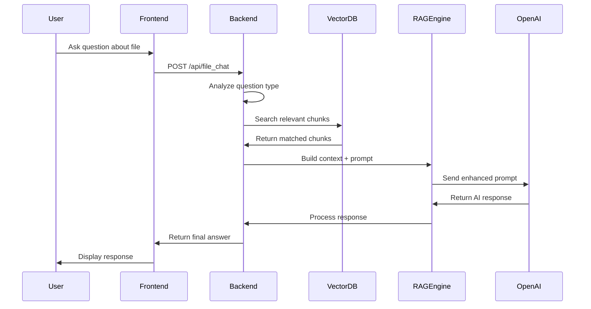

# 📚 RAG Application - Complete Flow Documentation

## 🎯 Overview

This is a **Retrieval-Augmented Generation (RAG)** application that allows users to upload various file formats and have intelligent conversations with the content. The application combines document processing, vector search, and large language models to provide contextual answers based on uploaded files.

## 🏗️ Architecture Overview

### High-Level Architecture Diagram



## 📋 Core Components

### 1. Frontend Components (Next.js/React)

#### Main Page Component (`frontend/src/app/page.tsx`)
- **Purpose**: Primary user interface for file upload and chat interactions
- **Key Features**:
  - File upload with format validation
  - Real-time chat interface with markdown support
  - Session management (multiple conversations)
  - Message editing and regeneration
  - Error handling and user feedback

#### Configuration (`frontend/src/utils/config.ts`)
- **Purpose**: Environment-based API URL configuration
- **Functionality**: Dynamically determines backend API URL based on environment

### 2. Backend Components (FastAPI/Python)

#### API Server (`api/app.py`)
- **Purpose**: Central FastAPI server handling all HTTP requests
- **Key Endpoints**:
  - `/api/upload_file` - File processing and indexing
  - `/api/file_chat` - RAG-based question answering
  - `/api/chat` - Generic chat without file context
  - `/api/health` - Health check and supported formats
  - `/api/remove_file` - Session cleanup

#### Multi-Format File Loader (`aimakerspace/multi_format_loader.py`)
- **Purpose**: Unified file processing for multiple formats
- **Supported Formats**:
  - **Documents**: PDF, DOCX, RTF, TXT, MD, HTML
  - **Spreadsheets**: XLSX, CSV
  - **Presentations**: PPTX
  - **Data**: JSON, YAML, XML
  - **Code**: SOL, PY, JS, TS, RS, GO, CSS, SCSS

#### Vector Database (`aimakerspace/vectordatabase.py`)
- **Purpose**: In-memory vector storage and similarity search
- **Features**:
  - Cosine similarity search
  - Async embedding generation
  - Text-based search interface

#### Text Processing (`aimakerspace/text_utils.py`)
- **Purpose**: Text chunking and PDF processing utilities
- **Features**:
  - Character-based text splitting with overlap
  - PDF text extraction

## 🔄 Complete Application Flow

### 1. File Upload Flow



#### Detailed File Upload Process:

1. **File Validation** (`api/app.py:106-130`)
   ```python
   # Check if file extension is supported
   supported_extensions = MultiFormatLoader.get_supported_extensions()
   file_extension = file.filename.split('.')[-1].lower()
   
   if file_extension not in supported_extensions:
       raise HTTPException(status_code=400, detail="Unsupported format")
   ```

2. **File Processing** (`aimakerspace/multi_format_loader.py:200-300`)
   ```python
   # Initialize loader and extract text
   loader = MultiFormatLoader(tmp_path)
   file_info = loader.get_file_info()
   texts = loader.load()  # Format-specific extraction
   ```

3. **Text Chunking** (`aimakerspace/text_utils.py:40-55`)
   ```python
   # Split texts into overlapping chunks
   splitter = CharacterTextSplitter(
       chunk_size=1500,
       chunk_overlap=375  # 25% overlap
   )
   chunks = splitter.split_texts(texts)
   ```

4. **Vector Database Creation** (`aimakerspace/vectordatabase.py:35-45`)
   ```python
   # Build vector database with embeddings
   vector_db = VectorDatabase(embedding_model=EmbeddingModel())
   await vector_db.abuild_from_list(chunks)
   ```

5. **Session Storage** (`api/app.py:170-180`)
   ```python
   # Store session with all components
   session_id = str(uuid.uuid4())
   file_sessions[session_id] = {
       'vector_db': vector_db,
       'chunks': chunks,
       'filename': file.filename,
       'file_type': file_extension,
       'file_info': file_info
   }
   ```

### 2. Chat/Query Flow



#### Detailed Chat Process:

1. **Question Analysis** (`api/app.py:240-270`)
   ```python
   # Detect broad vs specific questions
   def is_broad_question(question: str) -> bool:
       broad_patterns = ['summarize', 'overview', 'explain the file', ...]
       return any(pattern in question.lower() for pattern in broad_patterns)
   
   # Adaptive retrieval based on question complexity
   def get_retrieval_count(question: str) -> int:
       if is_broad_question(question):
           return min(len(chunks), 15)  # More chunks for broad questions
       return 4  # Default chunk count
   ```

2. **Vector Search** (`aimakerspace/vectordatabase.py:25-35`)
   ```python
   # Search for relevant chunks using embeddings
   def search_by_text(self, query_text: str, k: int) -> List[str]:
       query_vector = self.embedding_model.get_embedding(query_text)
       results = self.search(query_vector, k, cosine_similarity)
       return [result[0] for result in results]
   ```

3. **Context Building** (`api/app.py:290-320`)
   ```python
   # Build context from retrieved chunks
   if is_broad_question(request.question):
       # Use multiple search terms for comprehensive coverage
       search_terms = ['main', 'function', 'class', 'important', ...]
       relevant_chunks = get_diverse_chunks(search_terms)
   else:
       # Standard vector search
       relevant_chunks = vector_db.search_by_text(question, k=k)
   
   context = "\n\n".join(relevant_chunks).strip()
   ```

4. **RAG Prompt Engineering** (`api/app.py:355-365`)
   ```python
   # Enhanced prompt with strict context boundaries
   prompt = (
       f"You are answering questions ONLY based on the provided context "
       f"from the {file_type.upper()} file '{filename}'. "
       "IMPORTANT: If the question cannot be answered using the context, "
       "respond with: 'This question is outside the scope of the uploaded file.'\n\n"
       f"Context: {context}\n\n"
       f"Question: {request.question}\n\n"
       "Answer based ONLY on the provided context:"
   )
   ```

5. **Response Generation** (`api/app.py:365-385`)
   ```python
   # Generate response with OpenAI
   client = OpenAI(api_key=request.api_key)
   response = client.chat.completions.create(
       model=request.model,
       messages=[{"role": "system", "content": prompt}],
       temperature=0.1  # Low temperature for factual responses
   )
   
   # Post-process to catch out-of-context responses
   answer = response.choices[0].message.content
   if any(indicator in answer.lower() for indicator in out_of_context_indicators):
       return "❌ Out of Context Question"
   ```

## 🗂️ Data Structures and Models

### Session Data Structure
```python
{
    'session_id': 'uuid4-string',
    'vector_db': VectorDatabase,  # In-memory vector store
    'chunks': List[str],          # Text chunks from file
    'filename': str,              # Original filename
    'file_type': str,             # File extension
    'file_info': dict            # File metadata
}
```

### Message Data Structure (Frontend)
```typescript
interface Message {
    text: string;                 // Message content
    sender: 'user' | 'bot';      // Message sender
    id?: string;                 // Unique identifier
    isError?: boolean;           // Error flag
    errorMessage?: string;       // Error details
}
```

### Chat Session Structure (Frontend)
```typescript
interface Session {
    id: string;                  // Session ID
    name: string;               // Display name
    messages: Message[];        // Conversation history
    pdf?: {                     // File information
        filename?: string;
        chunkSize?: number;
        chunkOverlap?: number;
        numChunks?: number;
    };
}
```

## 🔧 API Endpoints Reference

### 1. File Upload Endpoint
```http
POST /api/upload_file
Content-Type: multipart/form-data

Parameters:
- file: UploadFile (multipart)
- api_key: string (form data)

Response:
{
    "session_id": "uuid",
    "filename": "document.pdf",
    "chunks": 45,
    "file_info": {...}
}
```

### 2. File Chat Endpoint
```http
POST /api/file_chat
Content-Type: application/json

Body:
{
    "session_id": "uuid",
    "question": "What is this document about?",
    "api_key": "sk-...",
    "model": "gpt-3.5-turbo"
}

Response: Plain text answer
```

### 3. Health Check Endpoint
```http
GET /api/health

Response:
{
    "status": "healthy",
    "aimakerspace_available": true,
    "supported_formats": {
        "pdf": "PDF documents",
        "docx": "Word documents",
        ...
    }
}
```

### 4. Generic Chat Endpoint
```http
POST /api/chat
Content-Type: application/json

Body:
{
    "user_message": "Hello!",
    "model": "gpt-3.5-turbo",
    "api_key": "sk-..."
}

Response: Plain text response
```

### 5. Remove File Endpoint
```http
POST /api/remove_file?session_id=uuid

Response:
{
    "message": "File removed from session."
}
```

## 🎨 Frontend Features

### 1. File Upload Interface
- **Drag & Drop Support**: Easy file selection
- **Format Validation**: Real-time format checking
- **Progress Feedback**: Upload status and processing indicators
- **Error Handling**: Clear error messages for unsupported formats

### 2. Chat Interface
- **Markdown Support**: Rich text rendering for responses
- **Message Editing**: Edit and regenerate AI responses
- **Copy Functionality**: Copy messages to clipboard
- **Session Management**: Multiple conversation threads

### 3. Advanced Features
- **Adaptive UI**: Responsive design for different screen sizes
- **Theme Support**: Consistent Material-UI theming
- **Real-time Updates**: Instant feedback during processing
- **Error Recovery**: Graceful error handling and recovery

## 🔍 Advanced RAG Features

### 1. Intelligent Question Detection
The system analyzes incoming questions to determine the best retrieval strategy:

```python
# Broad question patterns
broad_patterns = [
    'everything about', 'all about', 'entire', 'whole', 'complete',
    'summarize', 'summary', 'overview', 'explain the file',
    'what is the file all about'
]

# Content request patterns  
content_patterns = [
    'list', 'show', 'provide', 'give me', 'display',
    'entire code', 'full content', 'complete file'
]
```

### 2. Adaptive Retrieval Strategy
- **Broad Questions**: Retrieve 15+ chunks for comprehensive coverage
- **Specific Questions**: Retrieve 4-6 chunks for focused answers
- **Complex Questions**: Increase chunk count based on word count and complexity

### 3. Context Relevance Validation
```python
def is_context_relevant(question: str, context: str) -> bool:
    # Extract keywords from question and context
    question_keywords = set(extract_keywords(question))
    context_keywords = set(extract_keywords(context))
    
    # Calculate overlap ratio
    overlap = len(question_keywords.intersection(context_keywords))
    relevance_score = overlap / len(question_keywords)
    
    return relevance_score >= 0.1  # 10% minimum relevance
```

### 4. Multi-Strategy Search
For broad questions on large files:
```python
# Use multiple search terms for diverse chunk retrieval
search_terms = ['main', 'function', 'class', 'important', 'key']
all_relevant = []
for term in search_terms:
    chunks = vector_db.search_by_text(f"{question} {term}", k=3)
    all_relevant.extend(chunks)
# Remove duplicates while preserving order
```

## 🛡️ Error Handling and Edge Cases

### 1. File Processing Errors
- **Unsupported Formats**: Clear messaging with supported format list
- **Corrupted Files**: Graceful error handling with specific error messages
- **Empty Files**: Validation to ensure extractable content
- **Large Files**: Memory management and chunking strategies

### 2. Chat Errors
- **Out of Context Questions**: Intelligent detection and user guidance
- **API Failures**: Retry mechanisms and error recovery
- **Session Timeouts**: Session management and cleanup
- **Invalid Responses**: Response validation and filtering

### 3. Frontend Error Handling
- **Network Errors**: Connection retry and offline indicators
- **Invalid API Keys**: Clear validation and user guidance
- **Upload Failures**: Progress tracking and error reporting
- **UI State Management**: Consistent state across components

## 🚀 Performance Optimizations

### 1. Backend Optimizations
- **Async Processing**: Non-blocking file processing and embedding generation
- **Memory Management**: Efficient chunk storage and retrieval
- **Response Streaming**: Real-time response delivery
- **Caching**: Session-based caching for repeated queries

### 2. Frontend Optimizations
- **Component Memoization**: React optimization for rendering performance
- **Lazy Loading**: On-demand component loading
- **State Management**: Efficient session and message state handling
- **API Optimization**: Debounced requests and caching

### 3. Vector Search Optimizations
- **Cosine Similarity**: Fast vector comparison algorithm
- **Chunk Overlap**: Strategic overlap for better context preservation
- **Embedding Caching**: Reuse embeddings across sessions
- **Search Result Ranking**: Relevance-based result ordering

## 📊 Monitoring and Logging

### Backend Logging
```python
import logging
logging.basicConfig(level=logging.INFO)
logger = logging.getLogger(__name__)

# File processing logs
logger.info(f"Processing file: {file_info}")

# Search and retrieval logs
logger.info(f"Vector search for: {question} (k={k})")

# Error logging
logger.error(f"Error processing file: {str(e)}")
```

### Health Monitoring
- **Health Check Endpoint**: `/api/health` for system status
- **Dependency Validation**: Check for required libraries
- **Resource Monitoring**: Memory and processing status
- **Error Tracking**: Comprehensive error logging and tracking

## 🔧 Development and Deployment

### Local Development Setup
```bash
# Backend setup
cd api/
python -m venv venv
source venv/bin/activate  # On Windows: venv\Scripts\activate
pip install -r requirements.txt
python app.py

# Frontend setup
cd frontend/
npm install
npm run dev
```

### Environment Configuration
```bash
# Backend environment
OPENAI_API_KEY=sk-your-key-here

# Frontend environment
NEXT_PUBLIC_API_URL=http://localhost:8000/api
```

### Production Deployment Considerations
- **API Key Security**: Secure storage and transmission of API keys
- **CORS Configuration**: Proper cross-origin resource sharing setup
- **Load Balancing**: Multiple backend instances for scalability
- **Database Migration**: Move from in-memory to persistent storage
- **File Storage**: External file storage for uploaded documents
- **Monitoring**: Application performance monitoring and alerting

## 🎯 Conclusion

This RAG application provides a comprehensive solution for document-based question answering with:

1. **Multi-format Support**: Handles various document types seamlessly
2. **Intelligent Retrieval**: Adaptive search strategies based on question type
3. **Context-Aware Responses**: Strict adherence to document context
4. **User-Friendly Interface**: Intuitive chat interface with advanced features
5. **Robust Error Handling**: Comprehensive error management and user guidance
6. **Performance Optimization**: Efficient processing and search algorithms

The application demonstrates modern RAG architecture principles with practical implementations for real-world document analysis and question-answering scenarios. 